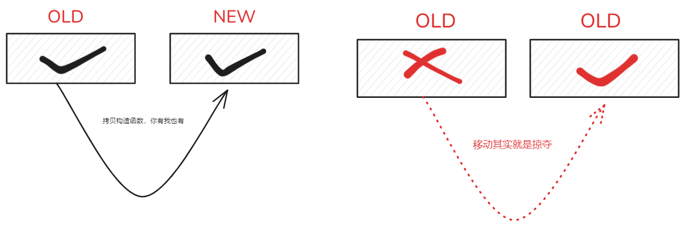

# move是C++11必经之路
大佬莫岩提到C++11中有三个有趣的东西分别是  function ,bind  这个确实厉害，直接干翻了设计模式很多大将，堪称是解耦神器
现在要介绍的是右值引用   &&  ， 这个是提升性能的一头野兽。不过在此之前我希望你先了解一下std::copy和std::memcpy。 因为接下来我会犯这样的错误。

起因是我看到kimi给我一个这样的回答
```cpp
Vector createVector() {
    Vector v;
    v.data = new int(10);
    return v; // 这里会调用移动构造函数
}
```
久疏沙场的我第一感觉这样是错误的，脑海中立刻浮现 铁律“不要返回局部对象的引用”。仔细发现它确实没有返回局部对象的引用 。它返回的是局部对象。习惯了返回int 之类简单值的我似乎有点不习惯这种方式了。 这是对的。他就类似于  class a = creatA();之类的调用。完全合理。只不过这里存在两种方式一种是  拷贝构造函数即默认调用
  `ClassA& operator=(Const ClassA& ta);`
 这个函数 。另一种是效率更高的方式 右值引用
`   ClassA operator=(const Class&&ta);`
移动构造函数并不是默认提供的，只有显示提供时候才会调用这种效率更高的方式
请看代码
```cpp

#ifndef __TESTCLASS_H__
#define __TESTCLASS_H__

#include <iostream>
#include <string>
#include <vector>
#include <algorithm>
#include <cstring>
 
class TestClass
{
private:
   //char* you_shoud_use_this;
   char name[20];
public:
    TestClass(const char*pname){
        std::cout<<"TestClass constructor"<<std::endl;
        std::memcpy(name,pname,sizeof(name));
    }
    ~TestClass(){}
    TestClass(const TestClass &tc)// copy constructor 不需要返回值 
    {
        std::cout<<"TestClass copy constructor"<<std::endl;
        std::memcpy(name,tc.name,sizeof(name));
    }
    
    TestClass& operator=(const TestClass &tc) // copy assignment 需要返回引用 以便连续赋值
    {
        std::cout<<"TestClass copy assignment"<<std::endl;
        if(this != &tc)
        {
            std::memcpy(name,tc.name,sizeof(name));
        }
        return *this;
    }

    TestClass(TestClass &&tc) // move constructor 移动构造函数
    {
        std::cout<<"TestClass move constructor"<<std::endl;
        std::memcpy(name,tc.name,sizeof(name));
    }

    TestClass& operator=(TestClass &&tc) // move assignment 移动赋值函数
    {
        std::cout<<"TestClass move assignment"<<std::endl;
        if(this != &tc)
        {
            std::memcpy(name,tc.name,sizeof(name));
        }
        return *this;
    }
    void Hello();
};

#endif // __TESTCLASS_H__

###################测试代码#############################
TestClass CrazyFunction() //验证是否会调用move constructor
{
   
    TestClass t("CrazyFunction");
   // return t;
   return std::move(t);
}
 
int main()
{
 
    TestClass t2 = CrazyFunction();
    t2.Hello();

    return 0;
}
 
```
以上我们显示的提供了移动构造函数，但是在实际测试中当我们使用  return t; 的时候并没有发生我们想想的 先构造 CrazyFunction 函数中的t 然后在调用拷贝构造函数，即
construct  +  copy construct  而是只有  construct 。这是因为我们的编译器默认开启了NVO返回值优化，简单来说就是编译器会尽量减少 copy construct 的运行而推迟到复制时候只运行一次  construct . 编译器的优化真真牛，当我们显示的调用 return std::move(t); 的时候发现确实失去执行了  move construct 即 一共执行了 construct+ mv construct .
<mark>但是 std::move 的目的是掠夺  而不是复制</mark>

而我们却在里面进行了 

简直就是哗众取宠。
正确的应该是 
<mark>name =std::move(tc.name);</mark>
正确的使用示例

```cpp

#ifndef __TESTCLASS_H__
#define __TESTCLASS_H__

#include <iostream>
#include <string>
#include <vector>
#include <algorithm>
#include <cstring>
 
class TestClass
{
private:
   char* large_data = nullptr;
   //char name[20]; //not this
public:
    TestClass(const char*pname){
        std::cout<<"TestClass constructor"<<std::endl;
        large_data = new char[strlen(pname)+1];
        std::memcpy(large_data,pname,strlen(pname)+1);
        
    }
    ~TestClass(){}
    TestClass(const TestClass &tc)// copy constructor 不需要返回值 
    {
        std::cout<<"TestClass copy constructor"<<std::endl;
         large_data = new char[strlen(tc.large_data)+1];
        std::memcpy(large_data,tc.large_data, strlen(tc.large_data)+1);
    }
    
    TestClass& operator=(const TestClass &tc) // copy assignment 需要返回引用 以便连续赋值
    {
        std::cout<<"TestClass copy assignment"<<std::endl;
        if(this != &tc)
        {
            large_data = new char[strlen(tc.large_data)+1];
            std::memcpy(large_data,tc.large_data,strlen(tc.large_data)+1);
        }
        return *this;
    }

    TestClass(TestClass &&tc) // move constructor 移动构造函数
    {
        std::cout<<"TestClass move constructor"<<std::endl;
        if(this != &tc)
        {
            //这里就有趣了,不再去申请内存,而是直接指向tc的内存
            large_data = tc.large_data;   //这里是浅拷贝
            tc.large_data = nullptr; //这里是浅拷贝
        }
    }

    TestClass& operator=(TestClass &&tc) // move assignment 移动赋值函数
    {
        std::cout<<"TestClass move assignment"<<std::endl;
        if(this != &tc)
        {
            large_data = tc.large_data;   //这里是浅拷贝
            tc.large_data = nullptr; //这里是浅拷贝
        }
        return *this;
    }

    void Hello();

};

#endif // __TESTCLASS_H__

 ```

# 总结
std::move 的性能确实很快，同时结合右值引用，相当于给了那些 本该被完整拷贝，或者释放的 资源一次额外续命的机会。相当于是直接易主。 易主以后注意就不要再去使用原来的资源了。因为按理来说原来的资源已经是null. 
同时注意，如果不显示的提供移动构造函数，是不会发生这个过程的。 需要显示并谨慎的提供。 然后也需要知道编译器强大的返回值优化技术。

## 未完待续 完美转发


## 参考链接 
[share?shareId=11aff082-649b-4c0f-bdd9-6f604ffde5da](https://lxblog.com/qianwen/share?shareId=11aff082-649b-4c0f-bdd9-6f604ffde5da)
