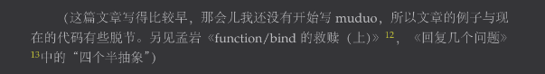

# 关于function和bind两个杀器的思考
function和bind 是在c++11以后提供的新功能。
function可以用来包装任何的和调用体，包括普通函数,lambda 函数，函数成员函数，甚至是重构了（）的类。function 也可以用来存储std::bind返回的可调用对象（只要签名信息匹配）。 
std::bind， bind更注重于创建一个新的可调用对象，比如 一个函数有三个参数，bind可以 只绑定其中两个，或1个来使用，进而产生一个新的可调用对象。 这个可调用对象可以直接使用，也可以存储在std::function容器中进行传递等等。

**std::function 和 bind 对传统的虚函数接口作为多态的实现发起了猛烈的攻击**

# 设计模式
##  创建型
嵌入式领域里面类的对象数量上通常不是很多，但是复杂性比较高。 所以最多用一个简单工厂方法就差不多了。最常用的还是一些全局的单例类。 可以提供各种工具帮助等等。
```cpp
#ifndef __SINGLECLASS_H__
#define __SINGLECLASS_H__

#include <iostream>
#include <mutex>
#include <thread>

class SingleClass
{
public:
    // 推荐，简单安全，缺点就是不能延迟初始化
    static SingleClass &GetIns()
    {
        static SingleClass ins; // C++11 以后，局部静态变量的初始化是线程安全的
        instance = &ins;
        return ins;
    }
    // 延迟初始化，但要注意线程安全问题
static SingleClass &GetIns2()
{
    if (instance == nullptr)
    {
        std::lock_guard<std::mutex> lock(m_mtx);
        if (instance == nullptr)
        {
            std::cout << "Create instance" << std::endl;    
            instance = new SingleClass();
        }
    }

    return *instance;
}

    void Hello()
    {
        std::cout << "Hello from SingleClass" << std::endl;
    }

private:
    static SingleClass *instance;
    static std::mutex m_mtx;
    

    // 删除拷贝构造函数和拷贝赋值操作符
    SingleClass(const SingleClass &other) = delete;
    SingleClass &operator=(const SingleClass &other) = delete;

    // 删除移动构造函数和移动赋值操作符
    SingleClass(SingleClass &&other) = delete;
    SingleClass &operator=(SingleClass &&other) = delete;

    SingleClass(/* args */)
    {
        std::cout << "SingleClass constructor" << std::endl;
    }
    ~SingleClass()
    {
        std::cout << "SingleClass destructor" << std::endl;
    }

    /* data */
};

SingleClass *SingleClass::instance = nullptr;
std::mutex SingleClass::m_mtx;

#endif // __SINGLECLASS_H__


```

## 结构型
结构型模式主要关注对象和类的组合。这些模式提供了如何构建软件组件的方法，以便它们可以更容易地被理解和维护。结构型模式通常涉及继承、组合和接口实现。
结构型模式的主要目标是：
>将大型复杂系统分解为更小、更易于管理的部分。
>提供新的接口来简化复杂系统的使用

适配器模式。适配器模式主要是为了兼容现有的接口，利用已经存在的实现进行封装一层以后满足新的需求。 举个例子 ，通常来说 client 客户端会持有一个基类的对象来实现服务，比如有一个 int request(int a,int b)接口，现在换平台了，新员工发现对接不上原来的需求， 为了能快速实现客户端的新需求 int  request(int a,int b,string c). 适配器模式通常需要通过继承原来的基类，然后对原来类的实现进行一些修改然后满足客户的新需求。

- 通过面向对象的继承，减少了重复的工作，可以快速的开发出新的demo。 但是复杂度比较高。因为继承是比较强的耦合关系
- 替代方案  std::function+ std::bind  client原来持有的是 一个基类的对象,如果需求比较简单完全可以只持有一个对应类型接口的函数指针。 然后由外部传入function对象来实现功能。如果需要的功能比较多，也完全可以进行一个struct 或class 进行封装  
**<mark>一不小心实现了 外观模式</mark> **

```cpp

  unique_ptr<OldClass>uni_ptr_oldc(new OldClass());
 
 auto new_func = [&uni_ptr_oldc](int a,int b,int c)-> void{
    int old_value = uni_ptr_oldc.get()->Add(a,b); 
    cout<<"Going to call old function with value "<<endl;
    int new_value = old_value*c;
    cout<<"New value is "<<new_value<<endl;
 };
 
  new_func(1,2,3);
  ```<mark></mark>


## 行为型
行为型模式应该说是收到新特性冲击最厉害的。结构型模式一般都是客户端持有一个基类类型的对象指针然后完成任务。 结构性模式似乎在一开始就已经假设好了对方基类的存在，并且基类会完成很复杂的任务。 而行为型模式也是基于此结构，但是解决问题的角度似乎是在客户端的角度。

结构型模式更像是面向类的设计，行为型模式是面向对象的设计模式。  大多数时候我们应该抛弃面向类设计的思想，因为耦合性太强了。上来就要继承。 如果遇到上来就让你提供UML的同事，那你得先去看看他的牙。 因为他的技术可能已经老掉牙了。

不仅仅关注类和对象的结构，重点关注他们之间的相互作用。而这正是std::function 和std::bind的绝对领域

比如观察者模式，此模式 通常是持有基类类型的指针，然如果需要一个对象改变通知N个对象的时候 ，则调用该类型对象的统一的虚函数接口。 这种类型的缺点就是 如果你想获取这个主题的消息就必须得继承它指定的类型。而 如果换成std::function 的方式则只需要一个 同样函数签名的 callback 就可以。看 耦合性 多么低。
还有同样的策略模式 以往都是需要继承策略模式的基类，然后实现别人的接口。现在不要了。

*现在仔细想想 std::bind 和  std::function 真是解耦神器！！*

点击链接查看和 Kimi 智能助手的对话 https://kimi.moonshot.cn/share/croh9i3f4kmu4hg88spg


