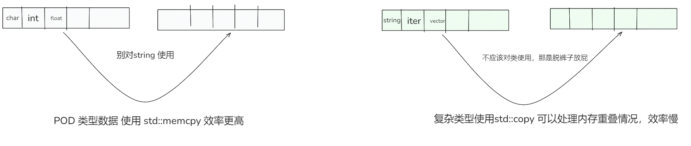

# 认识copy和memcpy




在学习std::move 时候偶然结实了 std::copy和std::memcpy 
在C语言中有 memcpy 和 memcmp 两个函数来处理内存的拷贝。 但是由于C++中的数据类型更多，除了POD（纯数据类型）还有自定义的类，包括string灯类型。因此c++的标准库中提供了更多的内存拷贝函数分别是 copy 和 memcpy

## 效率高但是使用范围有限的memcpy
二者都需要包含头文件 <cstring> 

```cpp
#include <iostream>
#include <cstring> // 使用 memcpy 和 strlen
#include <string>
#include "TestClass.h"  
#include "TestNameSpace.h"
 
int main() {
    
    char name[100] = "This is American, we dont share land with anyone";
    char dest[100];
    
    std::memcpy(dest,name,100); //字节拷贝 没问题
    std::cout << "dest: " << dest << std::endl; 
    std::string str1 = "I am a cowboy!";
    std::string str2 = "";
    std::memcpy(&str2,&str1,str1.size()); //字节拷贝 有问题   string不属于POD类型 
    std::cout << "str2: " << str2 << std::endl; //尽管他输出是正常的，但是这是未定义行为，不要这样做

    std::memcpy(dest,str1.c_str(),str1.size()); //string 往 char* 拷贝 有问题
    std::cout << "dest->: " << dest << std::endl; //输出是dest->: I am a cowboy!an, we dont share land with anyone
    //因为string的内存布局和char*不一样
 
    return 0;
}
 
```
在上面的代码中 虽然大部分场景都可以正常工作，但是 仅仅只有一个 纯字节拷贝是正确的，其他都是不安全的。 
**string 不是POD类型的数据！**


## 效率低但是可复制类的copy

```cpp
#include <iostream>
#include <cstring> // 使用 memcpy 和 strlen
#include <string>
#include "TestClass.h"  
#include "TestNameSpace.h"

class CopyMe{
public:
    CopyMe(const char* str):str_(str){
        std::cout << "CopyMe construct" << std::endl;
    }
    ~CopyMe(){
        std::cout << "CopyMe disconstruct" << std::endl;
    }
    CopyMe(const CopyMe& cm):str_(cm.str_){
        std::cout << "CopyMe copy construct" << std::endl;
    }
    CopyMe& operator=(const CopyMe& cm){
        std::cout << "CopyMe copy assignment" << std::endl;
        if(this != &cm){
            str_ = cm.str_;
        }
        return *this;
    }
    void print(){
        std::cout << "str: " << str_ << std::endl;
    }
    private:
    std::string str_;
};

int main() {
    
    //CopyMe 是一个自定义的类，我们准备使用它来测试 std::copy 和 std::memcpy 的区别
    CopyMe cm("hello");

    CopyMe cm2("");

    std::copy(&cm,&cm+1,&cm2); //这里会调用CopyMe的拷贝构造函数

    cm2.print();

程序运行结果 
CopyMe construct      
CopyMe construct      
CopyMe copy assignment
str: hello
CopyMe disconstruct   
CopyMe disconstruct  

    return 0;
}
 ```
紧接着我们想尝试复制一些更复杂的类型比如自定义类型。于是我们拿类进行举例。 但是从结果我们可以看到，当对类执行std::copy的时候实际上失去执行了类的赋值构造函数。 那如果是带有动态管理的资源，比如有个char* ,除非自己去提供赋值构造函数不然还是进行不了深拷贝。事实上也是这样的。std::copy 更应该用在迭代器的拷贝上，所以它里面有个代码 
<mark> std::copy(&cm,&cm+1,&cm2);</mark>  之所以第二个参数是&cm+1，因为他把整个对象看做一个迭代器，并不是实际上去计算迭代器所代表内容的实际内存大小。 所以他直接+1 .
正确的试用场景应该是 
```cpp
#include <algorithm>
#include <vector>
#include <iostream>

int main() {
    std::vector<int> vec1 = {1, 2, 3, 4, 5};
    std::vector<int> vec2(5); // 创建一个足够大的空 vector

    // 复制 vec1 到 vec2
    std::copy(vec1.begin(), vec1.end(), vec2.begin());

    // 输出复制后的 vector
    for (int num : vec2) {
        std::cout << num << ' ';
    }
    std::cout << std::endl;

    return 0;
}
```


## <mark>总结</mark>

std::memcpy 适用于POD类型的数据拷贝， 应该就是memcpy 换了个名， 然后为了应付一些string 和 c++ std 自带的容器类型的拷贝，准备了一个 std::copy。 这样可以安全的拷贝。 然后对于拷贝类对象那一套走的还是类的 赋值构造函数一套。和 std::copy 关系不大。 


## 参考链接
点击链接查看和 Kimi 智能助手的对话 https://kimi.moonshot.cn/share/crqhjlsubmsab0a17dr0


User: 对比std::memcpy 和 std::copy 

Kimi: `std::memcpy` 和 `std::copy` 是C++标准库中用于数据复制的两个函数，它们在用途和行为上有所不同：

1. **std::memcpy**：
   - `std::memcpy` 是C标准库函数 `memcpy` 的C++封装，它定义在 `<cstring>` 头文件中。
   - 它用于从源内存地址复制指定长度的字节到目标内存地址。
   - `std::memcpy` 不关心内存重叠问题，如果源和目标内存区域重叠，它可能会产生未定义的行为。
   - 它不检查内存对齐，可以复制任意类型的数据，包括非POD（Plain Old Data）类型。
   - 它通常比 `std::copy` 更快，因为它是专门设计用来复制字节的。

2. **std::copy**：
   - `std::copy` 是C++标准库中的算法，定义在 `<algorithm>` 头文件中。
   - 它用于复制元素从一个范围到另一个范围，元素通过使用赋值操作符进行复制。
   - `std::copy` 可以处理内存重叠的情况，如果源和目标内存区域重叠，它使用 `std::copy_backward` 来避免覆盖原始数据。
   - 它要求被复制的对象类型支持赋值操作，因此不能用于非POD类型，如包含虚函数的类。
   - 它通常比 `std::memcpy` 慢，因为它需要调用对象的赋值操作符。

**使用场景**：
- 当你需要复制字节数据，并且确信源和目标内存区域不重叠时，使用 `std::memcpy`。
- 当你需要复制的对象是复杂的C++对象，或者你需要处理内存重叠的情况时，使用 `std::copy`。

**示例**：
```cpp
#include <algorithm>
#include <cstring>
#include <iostream>

int main() {
    int src[5] = {1, 2, 3, 4, 5};
    int dst[5] = {0};

    // 使用 std::memcpy 复制数组
    std::memcpy(dst, src, sizeof(src));

    // 使用 std::copy 复制数组
    int dst_copy[5];
    std::copy(src, src + 5, dst_copy);

    // 输出结果
    for (int i = 0; i < 5; ++i) {
        std::cout << "dst[" << i << "] = " << dst[i] << ", dst_copy[" << i << "] = " << dst_copy[i] << std::endl;
    }

    return 0;
}
```

在这个示例中，`std::memcpy` 和 `std::copy` 都可以用来复制数组，但 `std::memcpy` 更适合这种简单的POD类型数据复制。 

User: 标准中有没有内存对比的函数接口。 

Kimi: C++标准库中确实提供了内存比较的函数，即`std::memcmp`。这个函数用于比较两个内存区域的内容是否相同，它定义在`<cstring>`头文件中，是C语言中`memcmp`函数的C++版本。

`std::memcmp`的函数原型如下：
```cpp
int memcmp(const void* buf1, const void* buf2, size_t count);
```
- `buf1`和`buf2`是要比较的两个内存区域的指针。
- `count`是要比较的字节数。
- 返回值：如果`buf1`在比较的字节内小于`buf2`，则返回负值；如果两者相等，则返回`0`；如果`buf1`大于`buf2`，则返回正值。

这个函数逐字节进行比较，一旦找到不同的字节，就停止比较并返回结果。如果需要比较的对象是C++对象，并且这些对象的比较逻辑不仅仅是比较字节，那么可能需要编写自定义的比较函数。

在使用`std::memcmp`时，需要确保你比较的内存区域是有效的，并且它们在比较期间不会被修改。对于非POD（Plain Old Data）类型，比如包含构造函数和析构函数的类，使用`std::memcmp`可能不安全，因为它不会调用对象的构造函数和析构函数，可能会导致对象处于不正确的状态。

总的来说，`std::memcmp`是一个用于比较内存块的有用工具，但在使用时需要注意其适用场景和限制。 

User: 这段代码使用 memcpy没问题吗?或者说 string 属于 POD？ 
    std::string str1 = "I am a cowboy!";

    std::string str2 = "";

    std::memcpy(&str2,&str1,sizeof(str1)); //字节拷贝 有问题
    std::cout << "str2: " << str2 << std::endl; 

Kimi: 在 C++ 中，`std::string` 不是一个 POD（Plain Old Data）类型。`std::string` 是一个类，它有自己的构造函数和析构函数，以及可能的其他成员函数。这意味着它需要正确的构造和析构来管理其内部状态（例如，它所管理的字符数组）。

使用 `std::memcpy` 来复制一个 `std::string` 对象是不安全的，因为这样做不会调用 `std::string` 的构造函数和析构函数，可能会导致未定义的行为。`std::memcpy` 只是简单地按字节复制内存，它不会处理类内部的动态分配内存或其他资源。

在你的代码示例中：

```cpp
std::string str1 = "I am a cowboy!";
std::string str2 = "";
std::memcpy(&str2, &str1, sizeof(str1));
std::cout << "str2: " << str2 << std::endl;
```

这段代码尝试使用 `std::memcpy` 来复制 `str1` 到 `str2`。这里有多个问题：

1. `sizeof(str1)` 返回的是 `std::string` 对象所占的字节数，而不是它管理的字符串的长度。这通常包括了动态分配的字符数组的指针、字符串的长度和容量等成员变量。所以，这样复制可能会导致只复制了字符串对象的一部分。

2. `str2` 没有被正确构造。`std::memcpy` 不会调用 `str2` 的构造函数，这意味着 `str2` 内部的动态内存指针可能没有被正确设置。

3. 如果 `str1` 的内容被修改（例如，通过 `std::string` 的成员函数），那么 `str2` 可能不会反映这些修改，因为它没有被设计为响应这种修改。

正确的复制 `std::string` 对象的方法是使用赋值操作符或者直接初始化：

```cpp
std::string str1 = "I am a cowboy!";
std::string str2 = str1; // 直接初始化
// 或者
std::string str2;
str2 = str1; // 使用赋值操作符
std::cout << "str2: " << str2 << std::endl;
```

这两种方法都会调用 `std::string` 的构造函数和赋值操作符，确保 `str2` 正确地复制了 `str1` 的内容和状态。 

User: 如何使用std::copy 来复制一个类的对象 

Kimi: 在 C++ 中，`std::copy` 是一个算法函数，用于从一个迭代器范围复制元素到另一个迭代器范围。它定义在 `<algorithm>` 头文件中。当你想要复制一个自定义类的对象时，可以使用 `std::copy` 来复制对象的各个成员变量，但这通常不是最佳做法，因为它不会调用类的构造函数或赋值操作符。

对于简单的类，如果你知道类的每个成员都可以被单独复制，你可以使用 `std::copy` 来复制每个成员。但对于具有动态内存分配或其他资源管理的类，你应该使用类的复制构造函数或赋值操作符来确保深复制。

以下是使用 `std::copy` 来复制类对象的一个例子，但请注意，这只适用于没有动态资源管理的简单类：

```cpp
#include <algorithm>
#include <iostream>

class MyClass {
public:
    int a;
    double b;
    char c;

    MyClass(int aa, double bb, char cc) : a(aa), b(bb), c(cc) {}
};

int main() {
    MyClass obj1(1, 2.5, 'A');
    MyClass obj2;

    // 使用 std::copy 复制对象的每个成员
    std::copy(&obj1, &obj1 + 1, &obj2);

    std::cout << "obj2.a: " << obj2.a << std::endl;
    std::cout << "obj2.b: " << obj2.b << std::endl;
    std::cout << "obj2.c: " << obj2.c << std::endl;

    return 0;
}
```

在这个例子中，`std::copy` 被用来逐个复制 `MyClass` 对象的成员。这适用于 `MyClass` 这样的简单类，因为它没有动态分配的资源。

然而，对于具有动态资源（如动态分配的内存、文件句柄、网络连接等）的类，你应该提供自己的复制构造函数和赋值操作符，以确保资源被正确复制。这种情况下，使用 `std::copy` 是不安全的，因为它只是按字节复制，而不考虑资源的深复制。

正确的做法是使用复制构造函数或赋值操作符：

```cpp
class MyClass {
public:
    int* data;

    MyClass(int value) {
        data = new int(value);
    }

    // 复制构造函数
    MyClass(const MyClass& other) {
        data = new int(*(other.data));
    }

    // 赋值操作符
    MyClass& operator=(const MyClass& other) {
        if (this != &other) {
            delete data;
            data = new int(*(other.data));
        }
        return *this;
    }

    ~MyClass() {
        delete data;
    }
};

int main() {
    MyClass obj1(42);
    MyClass obj2 = obj1; // 调用复制构造函数

    std::cout << "obj2.data: " << *obj2.data << std::endl;

    return 0;
}
```

在这个例子中，复制构造函数和赋值操作符确保了动态分配的内存被正确复制，从而避免了浅复制可能导致的问题。 

User: 如果MyClass 中含有string 变量可以使用 std::copy 而不提供自己的赋值构造函数吗？ 

Kimi: 如果 `MyClass` 中包含 `std::string` 变量，那么在大多数情况下，你不需要自己提供赋值构造函数和赋值操作符，因为 `std::string` 已经正确地管理了其内部的动态内存。`std::string` 有一个有效的复制构造函数和赋值操作符，它们会确保字符串数据被深复制。

以下是 `MyClass` 的一个例子，其中包含 `std::string` 成员：

```cpp
#include <string>
#include <iostream>

class MyClass {
public:
    std::string str;

    MyClass(const std::string& s) : str(s) {}
};

int main() {
    MyClass obj1("Hello World");
    MyClass obj2 = obj1; // 使用默认的复制构造函数

    std::cout << "obj2.str: " << obj2.str << std::endl;

    return 0;
}
```

在这个例子中，即使我们没有为 `MyClass` 提供自定义的复制构造函数，`obj2` 也会被正确复制，因为 `std::string` 的复制构造函数会被用来复制 `str` 成员。

然而，如果你想要使用 `std::copy` 来复制 `MyClass` 对象，这通常不是必要的，因为简单的赋值操作（如上面的示例）已经足够。如果你确实想要使用 `std::copy`，你可以这样做，但它通常用于更复杂的数据结构，比如数组或容器中的元素。

```cpp
#include <algorithm>
#include <string>
#include <iostream>

class MyClass {
public:
    std::string str;

    MyClass(const std::string& s) : str(s) {}
};

int main() {
    MyClass obj1("Hello World");
    MyClass obj2;
    
    // 使用 std::copy 复制对象
    std::copy(&obj1, &obj1 + 1, &obj2);

    std::cout << "obj2.str: " << obj2.str << std::endl;

    return 0;
}
```

在这个例子中，`std::copy` 会调用 `MyClass` 的复制构造函数来复制 `obj1` 到 `obj2`。但是，这种方法很少用于单个对象的复制，因为它更常用于复制对象的范围或容器中的元素。

总之，如果你的类包含 `std::string` 或其他标准库类型，通常不需要自定义复制构造函数和赋值操作符，除非你需要执行一些特殊的操作。在大多数情况下，直接赋值或使用默认的构造函数就足够了。 

User: 为什么这里是    
    std::copy(&obj1, &obj1 + 1, &obj2);  第二个参数的地址是 &obj1 + 1。 请举个常用于复制对象的范围或容器中的元素的例子 

Kimi: 在 `std::copy` 的例子中，`&obj1 + 1` 表示 `obj1` 所在内存地址的下一个位置的指针。这是因为 `std::copy` 需要源范围的开始和结束迭代器。由于我们只有一个对象 `obj1`，所以源范围是从 `&obj1` 开始，到 `&obj1 + 1` 结束，即只包含一个元素的范围。

这里是一个更常见的使用 `std::copy` 的例子，它用于复制数组或容器中的元素：

### 复制数组中的元素：

```cpp
#include <algorithm>
#include <iostream>

int main() {
    int src[] = {1, 2, 3, 4, 5};
    int dst[5]; // 确保 dst 有足够的空间来接收 src 中的元素

    // 复制 src 数组到 dst 数组
    std::copy(src, src + 5, dst);

    // 输出复制后的数组
    for (int i = 0; i < 5; ++i) {
        std::cout << dst[i] << ' ';
    }
    std::cout << std::endl;

    return 0;
}
```

### 复制 `std::vector` 中的元素：

```cpp
#include <algorithm>
#include <vector>
#include <iostream>

int main() {
    std::vector<int> vec1 = {1, 2, 3, 4, 5};
    std::vector<int> vec2(5); // 创建一个足够大的空 vector

    // 复制 vec1 到 vec2
    std::copy(vec1.begin(), vec1.end(), vec2.begin());

    // 输出复制后的 vector
    for (int num : vec2) {
        std::cout << num << ' ';
    }
    std::cout << std::endl;

    return 0;
}
```

在这两个例子中，`std::copy` 接受三个参数：

1. 源范围的开始迭代器。
2. 源范围的结束迭代器。
3. 目标范围的开始迭代器。

对于数组，我们使用指针来表示范围。对于 `std::vector`，我们使用 `begin()` 和 `end()` 成员函数来获取范围的迭代器。

`std::copy` 会逐个元素地复制源范围到目标范围，直到达到源范围的结束迭代器。在复制单个对象时，使用 `std::copy` 是不必要的，因为可以直接使用赋值操作符或复制构造函数。但在复制一个范围内的多个对象时，`std::copy` 非常有用。 


